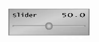
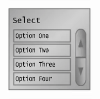
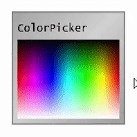

This repository was part of a student project in the course of study Game-Engineering at the [Kempten University of Applied Sciences](https://www.hs-kempten.de/).

# 1 - Getting Started

First of all you should download and set up a project with the [Vektoria Engine](http://games.hs-kempten.de/vektoria-download/), if you haven't already. 

After Vektoria is set up and running navigate to your project with a command line promt of your choosing and clone the repository:

``` sh
git clone https://github.com/AIexG/vektoria-gui.git
```

Alternatively you can simply [download the repository as a ZIP package](https://github.com/AIexG/vektoria-gui/archive/master.zip) and exctract it into your project.

Add all the header and source files to your Visual Studio Vektoria project e.g. by dragging and dropping it into your project in the Solution Explorer.

Finally add `#include "vektoria-gui/Gui.h"` in your header to gain access to the GUIs classes and functions.

# 2 - Usage

Every GUI element requires a CDeviceCursor to register interactions with the elements and a CWritingFont to display text on the element. Any GUI element then needs to be added to a CViewport.

**Header basis:**
``` C++
CDeviceCursor m_zdc;
CWritingFont m_zwfFont;
CViewport m_zv;
```

**Header:**
``` C++
GuiElement m_geElement;
```

**Source Init():**
```	C++
m_geElement.Init(&m_zdc, &m_zwfFont, CFloatRect(0.1f, 0.1f, 0.1f, 0.1f));
m_zv.AddOverlay(&m_gbButton);
```

In the `CGame::Tick()` of your program you're able to check if the user is hovering, grabbing or clicking an element, those states are available for every GUI element and can be called as follows:


****Source Tick():****
```	C++
if (m_geElement.IsHovered()) {
    // do something
}

if (m_geElement.IsGrabbed()) {
    // do something
}

if (m_geElement.IsClicked()) {
    // do something
}
```

**Positioning**

GUI elements can be relatively positioned with `CSprite::SetRect(CFloatRect)`, just like any other COverlay or CSprite, but it's also possible to set pixel values instead, which can remain consistent when resizing the window, if desired.

|Method|Usage|
|-|-|
GuiElement::SetSize(iSize)                             | Set element to a squared size
GuiElement::SetSize(iWidth, iHeight)                   | Set element to a rectangular size
GuiElement::SetPositionTopLeft(iTop, iLeft)            | Set elements position from the top left of the viewport
GuiElement::SetPositionTopRight(iTop, iRight)          | Set elements position from the top right of the viewport
GuiElement::SetPositionBottomLeft(iBottom, iLeft)      | Set elements position from the bottom left of the viewport
GuiElement::SetPositionBottomRight(iBottom, iRight)    | Set elements position from the bottom right of the viewport

**Resizing**

When resizing the window, the elements do not recalculate their pixel values automatically, you'll need to call the `ReSize()` method for every element.

```	C++
void CGame::WindowReSize(int iNewWidth, int iNewHeight)
{
	m_zf.ReSize(iNewWidth, iNewHeight);

	m_gbButton.ReSize();
	m_gsSlider.ReSize();
	m_gsSelect.ReSize();
	m_gicpPicker.ReSize();
}
```


## 2.1 - CGuiButton
Merely a simple button, which features visuals to show the current states.

<center>


</center>


Just call like the base CGuiElement:

**Header:**
```	C++
CGuiButton m_gbButton;
```

**Source Init():**
```	C++
m_gbButton.Init(&m_zdc, &m_zwfFont);
m_zv.AddOverlay(&m_gbButton);
```

**Source Tick():**
```	C++
if (m_gbButton.IsHovered()) {
    // do something
}

if (m_gbButton.IsGrabbed()) {
    // do something
}

if (m_gbButton.IsClicked()) {
    // do something
}
```

## 2.3 - CGuiSlider

A slider that allows you to smoothly select a certain number.

<center>



</center>

`Init()` allows you to set a min-, max-, default- ans step-value to precisely configure the slider to your requirements. Can also be adjusted or called with `CGuiSlider::InitParameters(fMin, fMax, fDefault, fStep)` if needed.

**Header:**
```	C++
CGuiSlider m_gsSlider;
```

**Source Init():**
```	C++
m_gsSlider.Init(&m_zdc, &m_zwfFont, 0.0f, 100.0f, 10.0f, 1.0f, CFloatRect(0.1f, 0.1f, 0.1f, 0.1f));
m_zv.AddOverlay(&m_gsSlider);
```

If changed by the user the method `CGuiSlider::HasUpdated()` will return true. The methods `CGuiSlider::GetValue()` will return the currently selected value.

**Source Tick():**
```	C++
if (m_gsSlider.HasUpdated()) {
    // do something
    m_gsSlider.GetValue();
}
```

## 2.4 - CGuiSelect

A select with scrolling capabilities.

<center>



</center>

An *indefinitely* amount of options can be added with the method `CGuiSelect::AddOption(string)`.

**Header:**
```	C++
CGuiSlider m_gsSlider;
```

**Source Init():**
```	C++
m_gsSelect.Init(&m_zdc, &m_zwfFont, 4, CFloatRect(0.1f, 0.1f, 0.1f, 0.1f));
m_gsSelect.AddOption("foo");
m_zv.AddOverlay(&m_gsSelect);
```

If an option has been selected or deselected by the user the method `CGuiSelect::HasUpdated()` will return true. The methods `CGuiSelect::GetActiveName()` and `CGuiSelect::GetActivePosition()` will return the currently selected name and position respectively and an empty string or `-1` if none is selected.

**Source Tick():**
```	C++
if (m_gsSelect.HasUpdated()) {
    // do something
    m_gsSelect.GetActiveName();
    m_gsSelect.GetActivePosition();
}
```

## 2.5 - CGuiImageColorPicker

A simple color picker to grab a color value when clicking inside the image area.

<center>



</center>

On default the color picker will show a wide color spectrum, but custom images can be set with an image path `CGuiImageColorPicker::SetImage(char*)` or with an already existing image `CGuiImageColorPicker::SetImage(CImage&)`, alternatively can also be set in the constructor.

**Header:**
```	C++
CGuiImageColorPicker m_gicpPicker;
```

**Source Init():**
```	C++
m_gicpPicker.Init(&m_zdc, &m_zwfFont);
m_zv.AddOverlay(&m_gicpPicker);
```

If a new color has been picked by the user the method `CGuiImageColorPicker::HasUpdated()` will return true. The method `CGuiImageColorPicker::GetColor()` allows you to read the last saved color value from the picker.

**Source Tick():**
```	C++
if (m_gicpPicker.HasUpdated()) {
    // do something
    m_gicpPicker.GetColor();
}
```

# 3 - Examples

A full working example consisting of a Game.h and Game.cpp for your project can be found in the directory [examples](https://github.com/AIexG/vektoria-gui/tree/master/examples). Simply rename the files accordingly.

# 4 - Tips and Tricks

**Displaying a console**

With the follow code snippets you can display a console additionally to your Vektoria main window, use this to quickly debug any kind of date or output error messages.

**Header:**
```	C++
#include <iostream>
```

**Source Init():**
``` C++
AllocConsole();
freopen("conin$", "r", stdin);
freopen("conout$", "w", stdout);
freopen("conout$", "w", stderr);
```

Output messages with `std::cout`.

Source:
``` C++
std::cout << "Hello Debug!\n";
```

# 5 - Known issues

- CGuiElements do not behave correctly when added as a child overlay to any `COverlay`.
